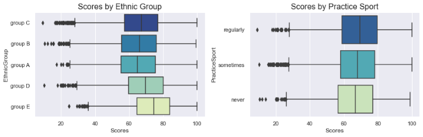

# Students Exam Scores
This project contains data cleaning and preprocessing, visualization, and analysis of the Students Exam Scores dataset from [Kaggle](https://www.kaggle.com/datasets/desalegngeb/students-exam-scores).
The analysis focuses on the influence of a variety of personal, socio-economic, and cultural factors on students’ academic performance.

## Overview
- Cleaned and preprocessed data
- Gained insights from descriptive statistics and variables distributions
- Visualized the overall exam scores by various study habits and social factors
- Evaluated if other personal factors have any effect on exam grades

## Resources Used
- Python 3.7
- Numpy and Pandas libraries for data manipulation
- Matplotlib and Seaborn libraries for data visualization

## Dataset
The Students Exam Scores dataset includes scores from three exams of students at a (fictional) public school and a variety of personal and socio-economic factors that may have interaction effects upon them. The dataset contains 30641 observations and 14 attributes.

- **Gender**: Gender of the student (male/female)
- **EthnicGroup**: Ethnic group of the student (group A to E)
- **ParentEduc**: Parent(s) education background (from some_highschool to master's degree)
- **LunchType**: School lunch type (standard or free/reduced)
- **TestPrep**: Test preparation course followed (completed or none)
- **ParentMaritalStatus**: Parent(s) marital status (married/single/widowed/divorced)
- **PracticeSport**: How often the student parctice sport (never/sometimes/regularly))
- **IsFirstChild**: If the child is first child in the family or not (yes/no)
- **NrSiblings**: Number of siblings the student has (0 to 7)
- **TransportMeans**: Means of transport to school (schoolbus/private)
- **WklyStudyHours**: Weekly self-study hours(less that 5hrs; between 5 and 10hrs; more than 10hrs)
- **MathScore**: math test score(0-100)
- **ReadingScore**: reading test score(0-100)
- **WritingScore**: writing test score(0-100)

## Data Cleaning and Preprocessing
The steps that I followed for cleaning the data and adding new variables are:

- Get insights from descriptive statistics and columns info 
- Check for duplicates
- Handle missing values
     - Numerical columns: impute missing values with the median of the variable
     - Categorical columns: impute missing values with the most frequent value in the column
- Drop unnecessary columns
- Map categories in columns
- Add two new columns:
     - **Scores** contains the average Math, Reading and Writing scores
     - **Grades** represents students' grades from A to F according to Overall Score

## EDA
**Insights** that I derived from descriptive statistics:

- Most of the columns have missing values.
- The average number of siblings is 2.
- The mean score for math, reading and writing is between 67-69. The scores have almost the same standard deviation which indicates similar variability.
- Some students scored very low on tests with a minimum of 0 for math, 10 for reading and 4 for writing. Other students scored very high as indicated by the maximum value of 100 for all the tests.
- From all the students, 25% scored below 56-59 and 25% scored above 78-80. The median value (50th percentile) shows that 50% of the students scored below the level of 67-70.

I made the following **visualizations**:

- Histogram of overall Scores
- Count plots of Grades, Test Preparation, Weekly Study Hours, Parent Education, Ethnic Group and Practice Sport
- Bar plot of Scores by Parent Education
- KDE plots of Scores by Test Preparation and Weekly Study Hours
- Box plots of Scores by Gender, Ethnic Group and Practice Sport

Some of the visualizations are presented below:

 

 

 

 

 

**Observations** about variables distributions: 

- The Overall Score has a normal distribution, skewed to the left, with a mean value of ~70
- Most students do not prepare for the tests.
- The greatest number of students got F grades, followed by D and C. The lowest count of grades is for students who got A's.
- Most students study between 5 and 10 hours per week. Only a small number of students study over 10 hours per week.
- The highest number of parents have some college education, and the lowest number have a master's degree.

### What factors influence students’ test scores?

Exploratory Data Analysis highlighted some factors that impact students’ ability to excel academically: 

- **Test preparation course**: Students who prepare for tests perform better than those who do not, across both genders.
- **Weekly self-study hours**: More study time (more than 10 hours per week) leads to higher overall grades.
- **Parent Education**: Parental education background has an impact on the child's educational status. Students with parents that have a master’s degree education level have the highest overall score.
- **Practice Sport**: Students who practice sport regularly have higher overall grades than those who don't.
- **Ethnic Group**: Students from Ethnic Group E perform better overall compared to their counterparts from other Ethnic groups recorded.
- **Gender**: Males achieve better scores than females in Math’s. Overall score is higher for females than males. In both cases this is evidenced by the higher median and 25th percentile scores.

Some of the variables, like the "Number of Siblings" or "IsFistChild", have no influence on the student’s grades.

